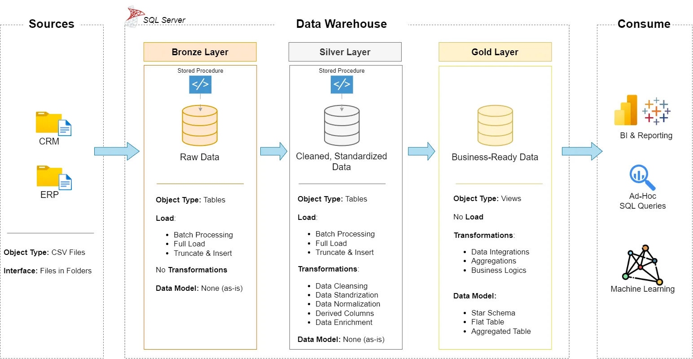

# **SQL Data Warehouse & Analytics**

This project demonstrates the end-to-end workflow expected in **Data Analyst** and **BI Analyst** roles, showcasing both data warehousing and analytics. It includes building a SQL Server data warehouse (Bronze, Silver, Gold layers) from raw ERP/CRM data and developing SQL-based exploratory analysis, advanced analytics, and customer/product reports.

---

## **🏗️ Data Architecture**

The data architecture for this project follows Medallion Architecture **Bronze**, **Silver**, and **Gold** layers:



1. **Bronze Layer**: Stores raw source data in its original form, ingested from CSV files into the SQL Server database.
2. **Silver Layer**: Applies data cleansing, standardization, and normalization to prepare consistent datasets for analysis.
3. **Gold Layer**: Delivers business-ready data organized into a star schema optimized for reporting and analytics.

---

## **🚀 Project Overview**

This project involves:

1. **Data Architecture**: Designing a Modern Data Warehouse Using Medallion Architecture **Bronze**, **Silver**, and **Gold** layers.
2. **ETL Pipelines**: Design and implement extraction, transformation, and loading processes to move data from source systems into the warehouse.
3. **Data Modelling**: Build fact and dimension tables structured for efficient analytical queries.
4. **Analytics & Reporting**: Develop SQL-based reports and dashboards that deliver actionable business insights.

**This repository serves as a strong portfolio piece, highlighting expertise in:**

- SQL Development
- Data Architect
- Data Engineering
- ETL Pipeline Development
- Data Modeling
- Data Analytics

---

## **📋 Project Requirements**

### **Building the Data Warehouse (Data Engineering)**

**Objective**

Build a modern data warehouse in SQL Server to consolidate sales data, providing a reliable source that supports analytical reporting and data-driven decision-making.

**Specifications**

- **Data Sources**: Import data from two source systems (ERP and CRM) provided as CSV files.
- **Data Quality**:  Clean and resolve quality issues to ensure accuracy and consistency before analysis.
- **Integration**: Consolidate both sources into a unified, user-friendly data model optimized for analytical queries.
- **Scope**: Limit to the latest dataset; historical data is excluded from this project’s scope.
- **Documentation**: Provide clear, well-structured documentation of the data model for both business stakeholders and analytics teams.

------

### **BI: Analytics & Reporting (Data Analysis)**

**Objective**

Develop SQL-based analytics that provide detailed insights into:

- **Customer Behavior**
- **Product Performance**
- **Sales Trends**

These insights will equip stakeholders with key business metrics to support strategic decision-making.

---

## ⚡ Getting Started

Follow these steps to set up and run the project in your local SQL Server environment.

##### 1. Create the Database

Run the initialization script to create the `sales_dw` database and base schema:

```sql
:r scripts/init_database.sql
```

##### **2. Load the Bronze Layer**

Execute the stored procedure to load raw ERP and CRM data into the Bronze layer:

```
EXEC proc_load_bronze;
```

##### **3. Transform to the Silver Layer**

Clean and standardize the Bronze data by running:

```
EXEC proc_load_silver;
```

##### **4. Build the Gold Layer**

Aggregate and model the Silver data into a star schema for analytics:

```
EXEC proc_load_gold;
```

##### **5. Verify the Results**

Query the Gold layer to confirm the warehouse is ready:

```
SELECT TOP 10 * FROM gold.dim_customers;
SELECT TOP 10 * FROM gold.dim_products;
SELECT TOP 10 * FROM gold.fact_sales;
```

After completing these steps, you will have a fully functional **Medallion Data Warehouse** (Bronze → Silver → Gold) ready for analysis.

------

## 📂 Repository Structure
```
data-warehouse-project/
│
├── datasets/                           # Raw datasets (ERP and CRM data in CSV format)
│   ├── source_crm/                     # CRM source data
│   └── source_erp/                     # ERP source data
│
├── docs/                               # Documentation and architecture diagrams
│   ├── 01_data_architecture.png        # Medallion architecture diagram
│   ├── 02_naming_conventions.md        # Naming guidelines for tables, columns, and files
│   ├── 03_data_flow.png                # Data flow diagram
│   ├── 04_data_integration.png         # Data integration overview
│   ├── 05_data_model.png               # Data model (star schema) diagram
│   └── 06_data_catalog.md              # Dataset catalog with field descriptions
│
├── scripts/                            # SQL scripts for ETL and analytics
│   ├── data_analytics/                 # SQL-based analytics and reporting
│   │   ├── 01_exploratory_data_analysis/   # Exploratory data analysis queries
│   │   └── 02_advanced_data_analysis/      # Advanced analytics and business reports
│   │
│   ├── layers/                        # ETL pipeline scripts following Medallion architecture
│   │   ├── 01_bronze/                 # Raw data ingestion
│   │   ├── 02_silver/                 # Data cleaning and standardization
│   │   └── 03_gold/                   # Star schema modeling for analytics
│   └── init_database.sql              # Script to initialize the database schema
│
├── tests/                              # SQL scripts for data quality checks
│   ├── 01_quality_checks_silver.sql    # Validations for Silver layer data
│   └── 02_quality_checks_gold.sql      # Validations for Gold layer data
│
├── README.md                           # Project overview and instructions
├── LICENSE                             # License information
└── .gitignore                          # Files and directories to ignore in Git
```
